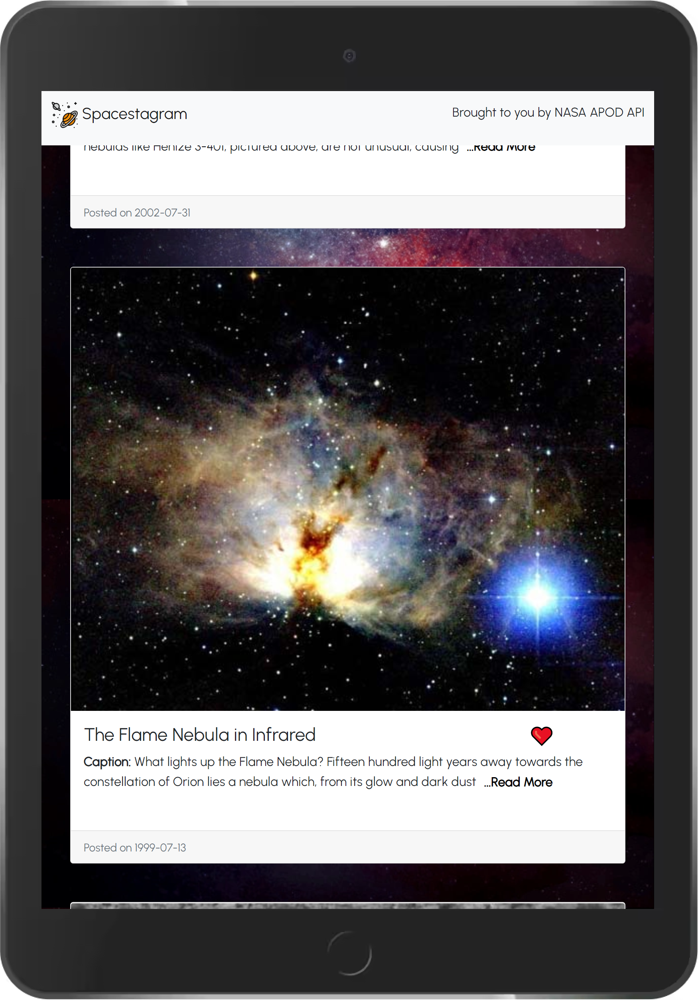

# Spacestagram
A website that displays 20 random images from NASA APOD (Astronomy Picture Of the Day) API. 
_This was built as part of the  application procedure of Shopify Frontend Intern (Winter 2022)._

## Features
- View images of space captured on different dates.
- Like and unlike images.
- Read More/Less Caption
- Shows Loading screen while data is being fetched from the API.

## Technologies Used
- ReactJS
- [NASA APOD (Astronomy Picture Of the Day) API](https://api.nasa.gov/)
- CSS3
- Bootstrap5

Background Image from [Freepik](https://www.freepik.com/) \
Logo from [Icons8](https://icons8.com/icons)

\
__Note:__ This project directory has been setup according to the assumption that it will be extended in the near future.

## Screenshots
__Dektop View__

__Tablet View__ \

__Mobile View__ \

